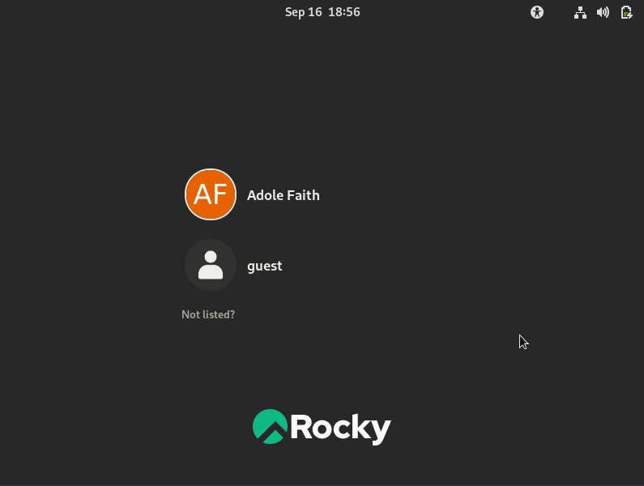

---
## Front matter
lang: ru-RU
title: Презентация по лабораторной работе № 2
subtitle: Информационная безопасность
author: Адоле Фейт 
institute: Российский университет дружбы народов, Москва, Россия
date: 16.09.2023
## i18n babel
babel-lang: russian
babel-otherlangs: english

## Formatting pdf
toc: false
toc-title: Содержание
slide_level: 2
aspectratio: 169
section-titles: true
theme: metropolis
header-includes:
 - \metroset{progressbar=frametitle,sectionpage=progressbar,numbering=fraction}
 - '\makeatletter'
 - '\beamer@ignorenonframefalse'
 - '\makeatother'
---

# Информация

## Докладчик

:::::::::::::: {.columns align=center}
::: {.column width="70%"}

* Адоле Фейт Эне
* студент группы НПМбд-02-20
* Факультет физико-математических и естественных наук
* Российский университет дружбы народов

:::
::::::::::::::

## Цель лабораторной работы

* Получение практических навыков работы в консоли с атрибутами файлов
* Закрепление теоретических основ дискреционного разграничения доступа в современных системах с открытым кодом на базе ОС Linux.
* Составление соотношение права доступа и разрешенных операций

## Выполнение лабораторной работы

## Создание гостевого пользователя

Я создала нового гостя, используя команду `useradd guest`, а затем установила пароль, используя команду `passwd guest`

## Результат

Это выходные данные, и отсюда мы можем видеть, что гостевой пользователь был создан и пароль установлен.

## Расширенные атрибуты для каждого каталога

* Для этого нам пришлось проверить доступный доступ к каждому каталогу.
* Внес несколько правок с помощью команды `chmod`
* Создавать, изменять и удалять файлы и каталоги

# Вывод

* Практический опыт работы с атрибутами файлов в консоли Linux
* Укрепление теоретических знаний в области ДСК (Дискреционного Управления Доступом)
* Понимание взаимосвязи между правами доступа и разрешенными операциями
