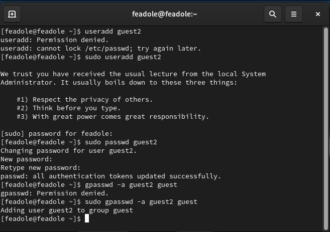
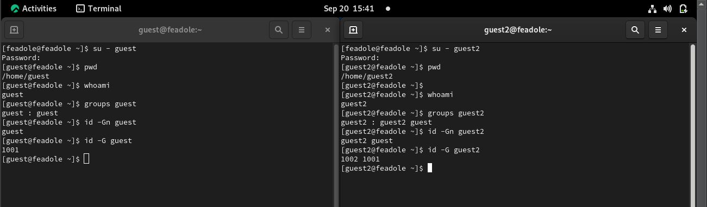
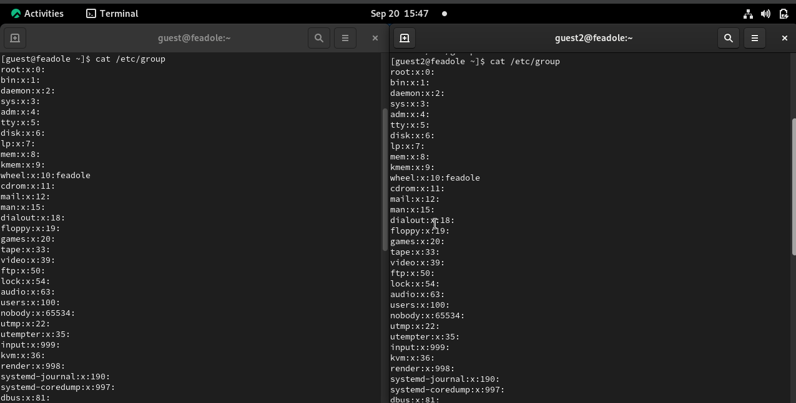
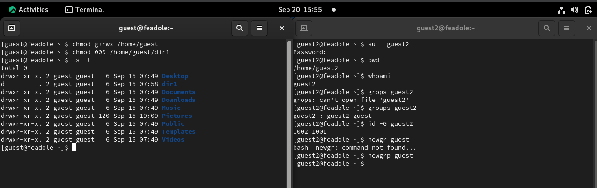

---
## Front matter
lang: ru-RU
title: Презентация по лабораторной работе № 3
subtitle: Информационная безопасность
author: Адоле Фейт 
institute: Российский университет дружбы народов, Москва, Россия
date: 20 .09.2023
## i18n babel
babel-lang: russian
babel-otherlangs: english

## Formatting pdf
toc: false
toc-title: Содержание
slide_level: 2
aspectratio: 169
section-titles: true
theme: metropolis
header-includes:
 - \metroset{progressbar=frametitle,sectionpage=progressbar,numbering=fraction}
 - '\makeatletter'
 - '\beamer@ignorenonframefalse'
 - '\makeatother'
---

# Информация

## Докладчик

:::::::::::::: {.columns align=center}
::: {.column width="70%"}

* Адоле Фейт Эне
* студент группы НПМбд-02-20
* Факультет физико-математических и естественных наук
* Российский университет дружбы народов

:::
::::::::::::::

## Цель лабораторной работы

* Получение практических навыков работы в консоли с атрибутами файлов для групп пользователей.
* Закрепление теоретических основ дискреционного разграничения доступа в современных системах с открытым кодом на базе ОС Linux.
* Составление соотношение права доступа и разрешенных операций

## Выполнение лабораторной работы
В лаборатории операционная система создала учетную запись пользователя с именем guest2 и установила для нее пароль. 
Guest2 был добавлен в группу guest. Два пользователя, guest и guest2, вошли в систему и были найдены в своих домашних каталогах. 
Были проверены права доступа пользователя и проверены членства в группах. 
Администратор системы рассмотрел данные о группах, и пользователь guest2 был добавлен в группу guest. 
Права доступа к каталогу /home/guest были изменены, и атрибуты были удалены из каталога /home/guest/dir1. 
Наконец, были выполнены различные действия для обновления таблицы разрешений и действий с точки зрения пользователей guest и guest2.

## Создание гостевого пользователя

Я создала пользователя и добавила его в группу, используя команду `sudo useradd guest2`, а затем установила пароль, используя команду `sudo passwd guest2`

Я проверила, в какие группы входят пользователи

## Результат

Это выходные данные, и отсюда мы можем видеть, что гостевой пользователь был создан и пароль установлен.

## Расширенные атрибуты для каждого каталога

* Для этого нам пришлось проверить доступный доступ к каждому каталогу.
* Внес несколько правок с помощью команды `chmod`
* Создавать, изменять и удалять файлы и каталоги

# Вывод

* В ходе выполнения данной лабораторной работы я получила практические
навыки работы в консоли с атрибутами файлов для групп пользователей