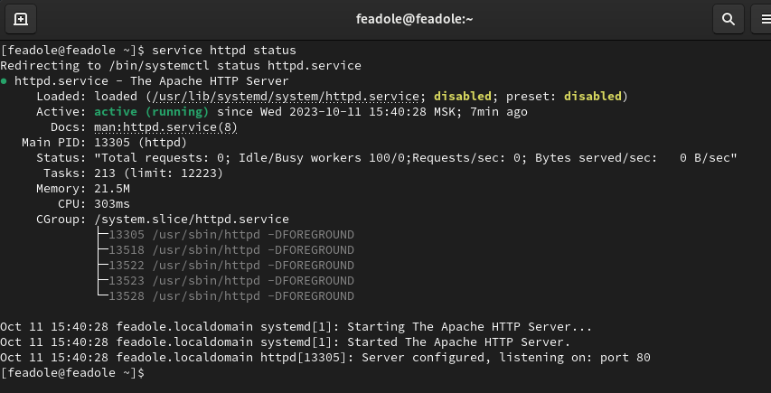
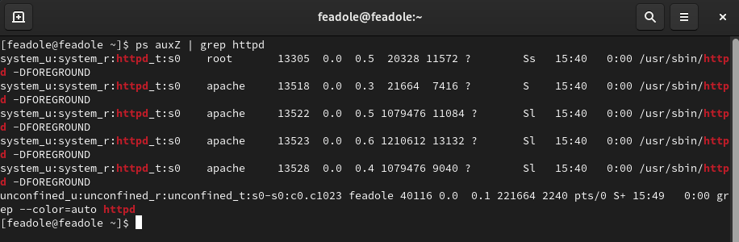
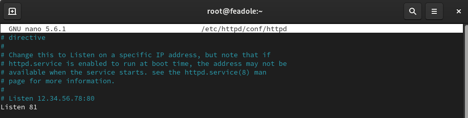
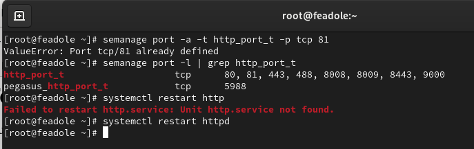
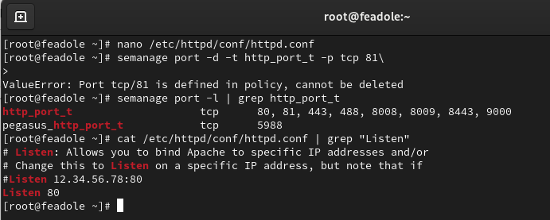
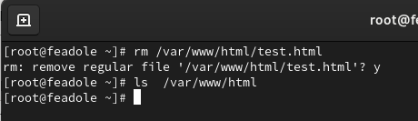

---
## Front matter
lang: ru-RU
title: Презентация по лабораторной работе № 6
subtitle: Информационная безопасность
author: Адоле Фейт 
institute: Российский университет дружбы народов, Москва, Россия
date: 12.10.2023
## i18n babel
babel-lang: russian
babel-otherlangs: english

## Formatting pdf
toc: false
toc-title: Содержание
slide_level: 2
aspectratio: 169
section-titles: true
theme: metropolis
header-includes:
 - \metroset{progressbar=frametitle,sectionpage=progressbar,numbering=fraction}
 - '\makeatletter'
 - '\beamer@ignorenonframefalse'
 - '\makeatother'
---

# Информация

## Докладчик

:::::::::::::: {.columns align=center}
::: {.column width="70%"}

* Адоле Фейт Эне
* студент группы НПМбд-02-20
* Факультет физико-математических и естественных наук
* Российский университет дружбы народов

:::
::::::::::::::

## Цель лабораторной работы

Развить навыки администрирования ОС Linux. Получить первое практическое знакомство с технологией SELinux. 
Проверить работу SELinux на практике совместно с веб-сервером Apache.

## Выполнение лабораторной работы

После входа в систему под своей учетной записью Обратилась с помощью браузера к веб-серверу, запущенному на моем компьютере, 
и убедилась, что последний работает с помощью команды “service httpd
status” и С помощью команды “ps auxZ | grep httpd” определила контекст безопасности
веб-сервера Apache - httpd_t 

:::::::::::::: {.columns align=center}
::: {.column width="60%"}
{#fig:001 width=50%}
:::
::: {.column width="60%"}
{#fig:002 width=50%}
:::
::::::::::::::

## Выполнение лабораторной работы(1)

В файле /etc/httpd/conf/httpd.conf заменила строчку “Listen 80” на “Listen 81”,
чтобы установить веб-сервер Apache на прослушивание TCP-порта 81.
Выполнила команду “semanage port -a -t http_port_t -р tcp 81” и убедилась, что
порт TCP-81 установлен. Проверила список портов командой “semanage port -l
| grep http_port_t”, убедилась, что порт 81 есть в списке и запускаем веб-сервер
Apache снова 

:::::::::::::: {.columns align=center}
::: {.column width="60%"}
{#fig:003 width=50%}
:::
::: {.column width="60%"}
{#fig:001 width=50%}
:::
::::::::::::::

## Выполнение лабораторной работы(2)

Исправила обратно конфигурационный файл apache, вернув “Listen 80”. Попыталась удалить привязку 
http_port к 81 порту командой “semanage port -d -t
http_port_t -p tcp 81”, но этот порт определен на уровне политики, поэтому его
нельзя удалить.
затем я Удалила файл “/var/www/html/test.html” командой “rm /var/www/html/test.html”
:::::::::::::: {.columns align=center}
::: {.column width="60%"}
{#fig:003 width=50%}
:::
::: {.column width="60%"}
{#fig:001 width=50%}
:::
::::::::::::::

# Вывод

В ходе выполнения данной лабораторной работы я развила навыки администрирования ОС Linux, 
получила первое практическое знакомство с технологией SELinux и проверила работу SELinux на 
практике совместно с веб-сервером Apache.