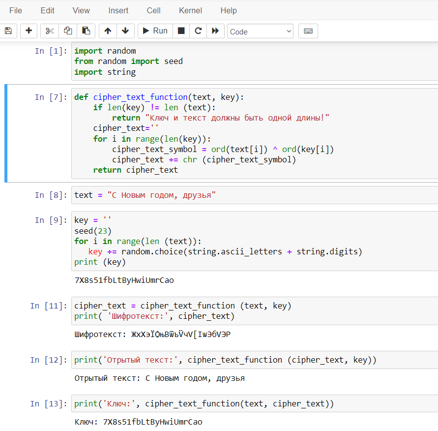

---
## Front matter
lang: ru-RU
title: Презентация по лабораторной работе № 7
subtitle: Информационная безопасность
author: Адоле Фейт 
institute: Российский университет дружбы народов, Москва, Россия
date: 19.10.2023
## i18n babel
babel-lang: russian
babel-otherlangs: english

## Formatting pdf
toc: false
toc-title: Содержание
slide_level: 2
aspectratio: 169
section-titles: true
theme: metropolis
header-includes:
 - \metroset{progressbar=frametitle,sectionpage=progressbar,numbering=fraction}
 - '\makeatletter'
 - '\beamer@ignorenonframefalse'
 - '\makeatother'
---

# Информация

## Докладчик

:::::::::::::: {.columns align=center}
::: {.column width="70%"}

* Адоле Фейт Эне
* студент группы НПМбд-02-20
* Факультет физико-математических и естественных наук
* Российский университет дружбы народов

:::
::::::::::::::

## Цель лабораторной работы

Освоить на практике применение режима однократного гаммирования.

## Выполнение лабораторной работы

## Создание программы

Я начала процесс с импорта необходимых библиотек, неотъемлемых для криптографических операций, которые последовали. Впоследствии 
я разработала специализированную функцию, способную выполнять операции побитового XOR на двух строках, облегчая процессы шифрования и дешифрования. 
Исходный текст, служащий оригинальным незашифрованным текстом, играл ключевую роль в последующих шагах. 
Ключ, тщательно созданный для соответствия длине исходного текста, генерировался для внесения дополнительного уровня безопасности в механизм шифрования.

## Выполнение лабораторной работы 2

Применяя ранее разработанную функцию, я легко получила шифротекст, предполагая знание как исходного текста, так и созданного ключа. Этот шифротекст, 
представляющий собой зашифрованную форму оригинального текста, служил важным посредником в криптографических процедурах. Кроме того, я продемонстрировала 
обратимость процесса, используя ту же функцию для получения исходного текста при наличии информации как о шифротексте, так и о ключе.

## Выполнение лабораторной работы 3

Интригующим образом, криптографический процесс не ограничивался лишь шифрованием и дешифрованием, но также распространялся на восстановление ключа. 
Снова воспользовавшись той же функцией, я успешно извлекла ключ, обладая информацией как о исходном тексте, так и соответствующем шифротексте. 
Этот всесторонний подход к криптографическим операциям подчеркивает взаимосвязанную природу шифрования, дешифрования и управления ключами в 
обеспечении целостности и конфиденциальности чувствительной информации.

## Выполнение лабораторной работы 4

:::::::::::::: {.columns align=center}
::: {.column width="60%"}
{#fig:001 width=50%}
:::
::: {.column width="60%"}
{#fig:002 width=50%}
:::
::::::::::::::

# Вывод

В ходе выполнения данной лабораторной работы я освоила на практике 
применение режима однократного гаммирования.
