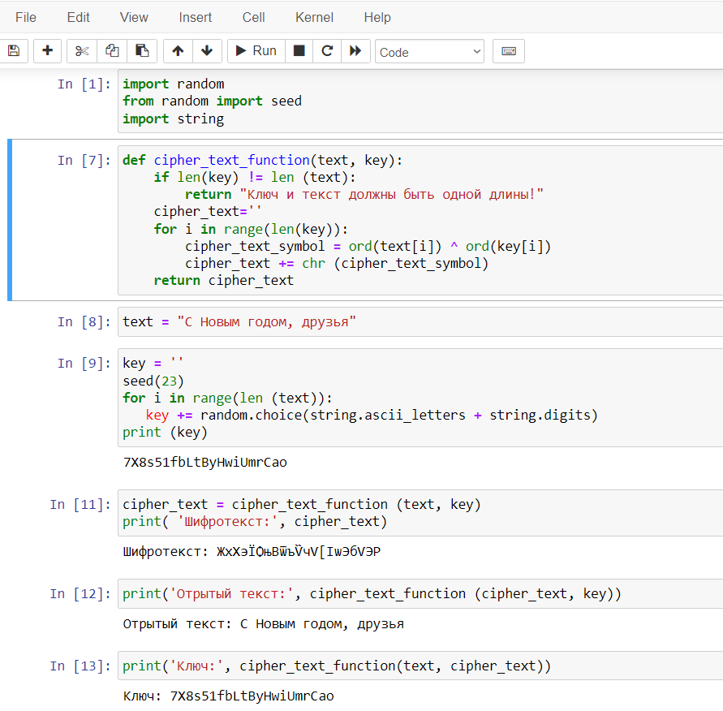
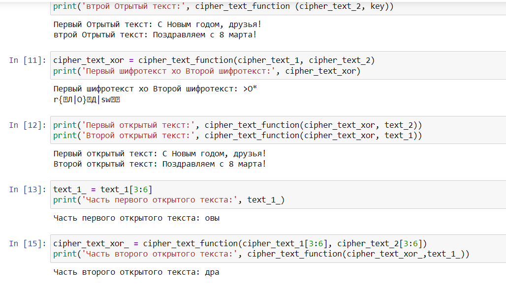

---
## Front matter
lang: ru-RU
title: Презентация по лабораторной работе № 8
subtitle: Информационная безопасность
author: Адоле Фейт 
institute: Российский университет дружбы народов, Москва, Россия
date: 19.10.2023
## i18n babel
babel-lang: russian
babel-otherlangs: english

## Formatting pdf
toc: false
toc-title: Содержание
slide_level: 2
aspectratio: 169
section-titles: true
theme: metropolis
header-includes:
 - \metroset{progressbar=frametitle,sectionpage=progressbar,numbering=fraction}
 - '\makeatletter'
 - '\beamer@ignorenonframefalse'
 - '\makeatother'
---

# Информация

## Докладчик

:::::::::::::: {.columns align=center}
::: {.column width="70%"}

* Адоле Фейт Эне
* студент группы НПМбд-02-20
* Факультет физико-математических и естественных наук
* Российский университет дружбы народов

:::
::::::::::::::

## Цель лабораторной работы

Освоить на практике применение режима однократного гаммирования на
примере кодирования различных исходных текстов одним ключом.

## Выполнение лабораторной работы

## Создание программы

Я начала с импорта необходимых библиотек. 
Затем я реализовала функцию для сложения по модулю два двух строк. Открытые или исходные тексты имели одинаковую длину. 
После этого я создала ключ такой же длины, что и открытые тексты. 
С использованием ранее созданной функции я получила шифротексты, предполагая знание как открытых текстов, так и ключа. 
Точно так же я извлекла открытые тексты с использованием ранее созданной функции, предполагая знание как шифротекстов, так и ключа. 

## Выполнение лабораторной работы 2

Кроме того, я выполнила сложение по модулю два двух шифротекстов с использованием ранее определенной функции. 
Кроме того, я получила открытые тексты при условии знания как обоих шифротекстов, так и одного из открытых текстов. 
Также я извлекла сегмент первого открытого текста с помощью среза. Наконец, я получила сегмент второго текста, расположенный 
на позициях символов сегмента первого открытого текста, с использованием ранее созданной функции, предполагая знание как обоих шифротекстов, 
так и части первого открытого текста.

## Выполнение лабораторной работы 3

:::::::::::::: {.columns align=center}
::: {.column width="60%"}
{#fig:001 width=50%}
:::
::: {.column width="60%"}
{#fig:002 width=50%}
:::
::::::::::::::

## Выполнение лабораторной работы 4

:::::::::::::: {.columns align=center}
::: {.column width="60%"}
{#fig:001 width=50%}
:::
::: {.column width="60%"}
{#fig:002 width=50%}
:::
::::::::::::::

# Вывод

В ходе выполнения данной лабораторной работы я освоила на практике применение режима 
однократного гаммирования на примере кодирования различных исходных текстов одним ключом.